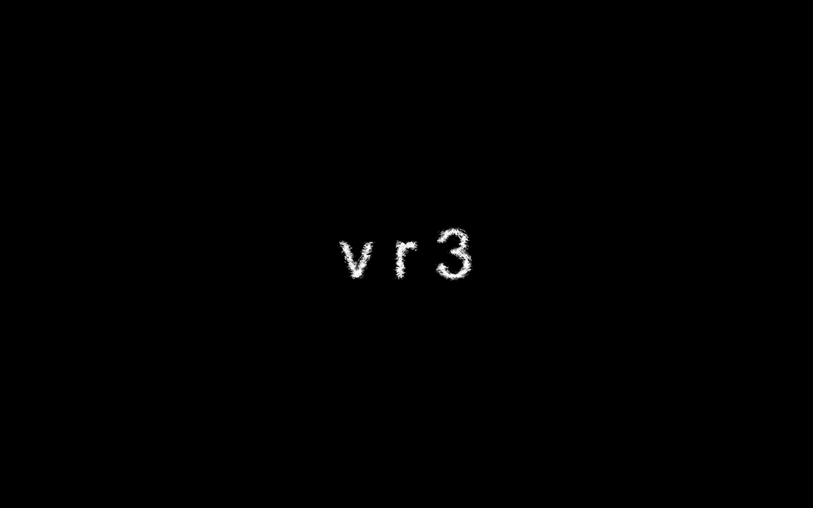

# *v r 3* Press Kit

#### Download v r 3
* [v r 3 for Mac OS X](https://github.com/pippinbarr/v-r-3/releases/download/v1.0/vr3-mac.zip)
* [v r 3 for Windows](https://github.com/pippinbarr/v-r-3/releases/download/v1.0/vr3-windows.zip)

## The basics

* Developer: [Pippin Barr](http://www.pippinbarr.com/)
* Release: 29th of March, 2017
* Platform: Mac OS X and Windows
* Code repository: https://www.github.com/pippinbarr/v-r-3/
* Price: $0.00

## Description

Water! Water! Everywhere! All kinds! Best Water! Decent Water! Realistic Water! Manga Water! Mobile Water! Magic Water! But not a drop to drink!

## History

*v r 3* came about thanks to a student project during a class at Concordia University. A student had used Unity's free "professional water" shader to display water in their game and during a conversation we both admired the impressive reflections and generally "high tech" feeling of the water. When I found out the water was literally referred to in the engine as "pro water" I found this too funny not to base a game around.

As part of the Speculative Play project I'm a part of I became interested in the idea of a game which is entirely about tech fetishism. Water is perhaps the archetypal technology we use to assess how "good" a game engine or game is in terms of realism, a kind of benchmark. I liked the idea of a speculative future in which, rather than playing a game with water in it, people would choose to simply contemplate the water itself as an activity. Thus *v r 3* represents a museum/gallery experience where the audience pays attention to water.

There's a huge amount to say about this, but the story is really told in the blog posts I've written about the game, linked below.

## Technology

*v r 3* was made in [Unity](http://unity3d.com).

*v r 3* is an open source game licensed under a [Creative Commons Attribution-NonCommercial 3.0 Unported License](http://creativecommons.org/licenses/by-nc/3.0/). You are looking at the code (and process and press) repository right now. Note that all third-party water purchased and/or downloaded from the Unity Asset Store used in the game has been removed from the repository.

## Features

* Water!
* Water!
* More water!
* Another water!
* Care for some water?!

## Videos

### [v r 3 Trailer](https://www.youtube.com/watch?v=20YTk95kG34)

## Images

     

## Press
* Coming soon?

## Additional Links

* [Developer blog posts about *v r 3*](http://www.pippinbarr.com/tag/v-r-3?order=asc)

## Credits

* Pippin Barr: everything.

## Contact

* Email: [pippin.barr+press@gmail.com](mailto:pippin.barr+press@gmail.com)
* Website: [www.pippinbarr.com](http://www.pippinbarr.com/)
* Twitter: [@pippinbarr](https://www.twitter.com/pippinbarr)
* Facebook: [Pippin Barr](http://www.facebook.com/pippin.barr)
