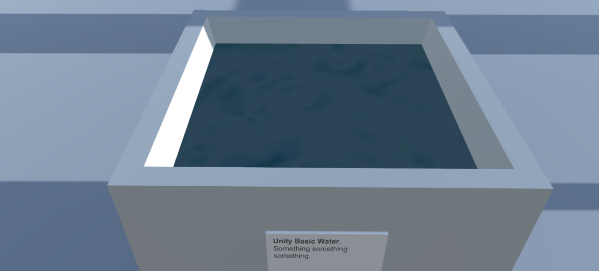

# Blog Posts

Here are public-facing blog posts I wrote about the game.

## New Project: v r 3 (2017-01-30)

Have started off on a new project post-_[SNAKISMS](http://pippinbarr.github.io/SNAKISMS)_. I&#8217;m calling it _v r 3_ after a relatively agonising process of coming up with a name for it. The core idea is that it will be a kind of gallery/museum space exhibiting&#8230; virtual stuff. I started off calling it the &#8220;New Scene Gallery&#8221;, but never felt comfortable with that. After deciding to use the Marfa buildings from _v r 2_ as the gallery space, it started to seem sensible to just acknowledge that this is another step along in the _v r_ series and name as as such.

This is a shame in the sense that it loses, I think, some of the sense of a &#8220;permanent&#8221; virtual space online for exhibitions, but it frees me up to do things differently for each &#8220;show&#8221; I suppose, from different landscapes to different buildings to&#8230; whatever. So _v r 3_ it is. The gallery/museum space itself will have no name I think.

The first exhibition (the one in _v r 3_ specifically) is going to be of water. I&#8217;ve been really interested in water technology in the Unity engine since a student waxed lyrical about how beautiful the &#8220;Unity Pro Water&#8221; is and demonstrated as much in a particular scene that was dark with neon lights reflecting in the water. It really is impressive water, and the fact that one can be impressed by water interests me. The fact it&#8217;s call &#8220;pro water&#8221; is also quite hilarious. There&#8217;s a lot going on, in short, around this idea of water as technology, water as something beautiful, perhaps water as something to be looked at (rather than incidental or scene-setting). So that&#8217;s what this exhibition is going to be about.

The current idea is to exhibit both Unity&#8217;s &#8220;professional water&#8221; and third-party waters from the Unity Asset Store, which is a whole other strange concept. Third-party water, water you might pay for, water with different aesthetic goals and implementations. It&#8217;s great.

So that&#8217;s what I&#8217;m up to for the moment. Hopefully it won&#8217;t take me too long to put together, but everything always takes too long, so this will too.

## So that's why curators have technicians (2017-02-03)

Work continues on _v r 3_, my exhibition of water. Yesterday I started actually messing around in Unity itself putting water all over the place and attempting to have it behave itself.

I&#8217;ve written about this sort of thing before, but I&#8217;m always really interested in the strange parallels that come up when you&#8217;re trying to do some sort of &#8220;job&#8221; in a game creation context. Whether it&#8217;s setting up the staging of a Eurovision show (_Epic Sax Game_) or doing the interior design for a non-existent institute (_Digital Marina Abramovic Institute_), there are always these situations where you&#8217;re trying to accomplish a task in digital space that is most often done in physical space. Setting up an exhibition of water is another example of this experience.

The most interesting thing here, of course, is the ways in which the digital impinges on the task, making some things much easier, some things harder, and some things just strange. So you can organise a gallery space by just cutting and pasting a file from a previous project, but in the same breath you might find out that light somehow shines through one of its walls which you need to fix. There have been various oddities like this that have cropped up so far in a single day of working on _v r 3_. Here are two.

_You can&#8217;t lean over_. In designing the plinth to hold the water I wanted it to be as similar as possible to the cubes in _v r 2_ as a kind of continuation and consistency. But in thinking about labelling and the ability to actually look at the water itself, it occurs to me that a really typical movement people perform in galleries is leaning over something that is lower down in space. The typical avatar always stands completely upright, just swivelling their neck around or, at best, doing a really weird crouch in which they lower themselves straight down in some kind of creepily smooth squat before scooting around the landscape like that. There&#8217;s no really naturalistic way to look at something from other postures. And this kind of rigid body (physics joke for you fans out there) has implications for the kind of display technology you then end up using. Maybe the plinth has to be higher so that the weirdo viewing the show is able to look clearly. Maybe the audience member has to be fitted with terrifying telescoping eyes so they can &#8220;zoom in&#8221; on things they can&#8217;t lean toward. Maybe the didact with the information about the particular piece they&#8217;re looking at has to be angled at 45 degrees to be legible, or has to be in extra large type. Etc. Consequences.

_Water isn&#8217;t water_. The water I&#8217;m displaying in _v r 3_ is obviously not &#8220;really&#8221; water, right? It&#8217;s not just a physical substance that behaves according to the laws of physics. Now, if I were having this show in reality, there would be all kinds of problems around displaying water, like the risk of it spilling or evaporating, of somebody trying to drink it or splash it, or of it leaking through the materials of the plinth, say. None of those issues are issues in a digital space, though &#8211; in those ways digital water is very neat and tidy and resistant to interaction. However, it doesn&#8217;t play nice in other ways. You can&#8217;t, for instance, take for granted that the world will be reflected correctly from the surface of the water (should you choose to _enable_ reflections, which is a decision you can make). Instead, I fought for a couple of hours with the phenomenon of looking down into a pool of water only to see various bits of the reflective world pop in and out of existence. This does not happen, as far as I know, with real physical water. There&#8217;s lots of stuff like this. At one point I had multiple pools of water and realised they were all co-dependent &#8211; when I changed the colour of one (again, easy to do, no dye required) they all sympathetically changed colour. Not what I wanted. And on and on it goes. Currently I&#8217;m dealing with an issue where if you stand a really specific distance from the water and look into it, it refracts the world around it in a kind of scary infinite-looking regression of swirling shapes. A bit like a demon is about to swim up out of it and claim your soul. Not what I want.

So, once again I&#8217;m brushing up against all of these oddities of virtual spaces and virtual objects and virtual liquids. On the one hand they&#8217;re often very clean and simple to deal with or move around or remove or add, but on another hand they sometimes all too much like what they are, assemblages of code and assets that may or may not reflect reality.

Splish splash.

## My digital water's like a swamp, full of bugs (2017-02-06)

Oh hi, I&#8217;m still working away on _v r 3_ at the times when I can do that, and it&#8217;s been quite the ride of highs and lows. Sometimes I&#8217;m really, really pleased with the overall idea and how I think it will look and feel when it&#8217;s done (and yes, I know this feeling may be limited to me and like two other people), and other times I&#8217;m feeling really, really down.

Because it turns out to be _inanely difficult_ to put water in a bunch of plinths in a virtual gallery. It sounds easy, but it ain&#8217;t. As I&#8217;ve said before, a lot of it is fairly easy in terms of the basic physics of putting objects in a virtual space etc., in ways that would be hard to do in regular old reality. But it&#8217;s the weird technicalities that are proving remarkably resistant to my &#8220;vision&#8221;.

As I work with Unity&#8217;s free &#8220;professional water&#8221; more and more I&#8217;m getting considerably deeper into thinking about what it is and how it works, because I just keep running into incredibly frustrating mistakes and, perhaps, bugs. It&#8217;s really interesting to me that there&#8217;s this process of needing to understand what&#8217;s going on at lower and lower levels of this piece of technology (and, of course, that the water _is a technology_ in the first place). It&#8217;s not enough to just grab a &#8220;prefab&#8221; (a pre-build example of water that comes with the software) and drop it into the gallery, because I have a bunch of constraints. The chief of which is needing _multiple instances_ of water in my environment, rather than just the usual single body of water (like a lake or whatever), and importantly that those multiple instances explicitly need to have different parameters set on them (reflective, refractive, or not, etc.).

Because of my requirements, which make total sense to me, I&#8217;m having a lot of difficulty. It turns out, at least to this point of my knowledge of Unity&#8217;s water, that the water doesn&#8217;t seem to &#8220;want&#8221; to exist in multiple configurations in the same space. So if I make some water that&#8217;s only reflective, and some other water that&#8217;s both reflective and refractive, they will enter into some sort of weird &#8220;possible universes&#8221; situation where, depending on how you look at one of them, it will flip between being reflective or refractive and back again. Not the ideal behaviour for water. I&#8217;ve now reached the point of going all the way down to reading the underlying code that defines the water itself to try to figure this out, without too much luck as yet.

A weird addition to all this is that of course I could at some point choose to _exhibit_ these weird behaviours as part of this &#8220;show&#8221; of water, or even a separate show of things that don&#8217;t work the way they&#8217;re meant to? On and on it goes&#8230;

## Water as Time Dilator (2017-02-13)

Just some brief words this evening since I&#8217;m kind of weary and forgot to write anything while I was more coherent earlier in the day. Still working on _v r 3_, still running into frustrating but simultaneously interesting technical issues.

So I have finally, finally managed to put different kinds of Unity professional water into all my plinths. This included editing the water script itself and doing a little big of shader debugging, neither of which I envisaged needing to touch when I started the project. However, it now turns out that if you have all (or many) of the plinths in your visual field while playing the game (at least on the MacBook Air that I do everything on), the framerate drops significantly and everything gets a bit dodging-a-bullet-in-the-Matrix.

Clearly the work of rendering all these different planes of water at the same time is kind of killing the performance, which I guess is fair enough? I wouldn&#8217;t know. I think there&#8217;s already something strange and intriguing there, right? That water, ostensibly this innocuous physical substance can _slow time itself_ is pretty remarkable. Game engines just do the darndest things. So water turns out to be, in some sense, expensive for the graphics rendering of the game, especially when you have the game rendering 24 different planes of different water, animating them, presumably performing reflection and refraction calculations etc. etc. Perhaps that&#8217;s just more than one should expect. So the water does time dilation. Fine.

Some investigation showed that even water that isn&#8217;t actually _visible_ to the camera is still being rendered, which is a pain. It would be nice if the computer didn&#8217;t have to grind away on all the computation required to display water I can&#8217;t see. This led me down the rabbit hole of looking at occlusion in Unity thanks to Ben Gattet, and we managed to get these cool visualisations of what the avatar (camera) can see and what&#8217;s being rendered and so on. Water is definitely being rendered even when it&#8217;s technically not visible. And this is apparently because the things hiding it (e.g. the sides of the plinths) aren&#8217;t big enough to be considered for &#8220;occlusion culling&#8221; (the process by which the game engine decides whether or not something is hidden from view and thus doesn&#8217;t bother rendering it at all).

I tried a few tricks in this world, notably trying to define a much smaller definition of what could count as occluding something else, but that started to crash my computer and generate insanely large files storing all the data, so it doesn&#8217;t look like that&#8217;s a winner. In my daydreams I&#8217;ve been thinking about writing a custom script to hide all water a certain distance from the avatar, but I don&#8217;t know if that would work or just look horrible.

Which all leads to a question about the overall exhibition of water itself. If the idea is to demonstrate Unity&#8217;s professional water set up with different parameters, and if the act of doing so causes the game to slow down, am I right in trying to &#8220;fix&#8221; that problem, or is that actually _part of how the water is experienced_? Just as much as some water is see through and some is opaque and some is red and some is pixellated, isn&#8217;t it also the case that, as an overall exhibition, the water just happens to slow down time? Maybe that&#8217;s just a &#8220;physical&#8221; property of water in this setting. It _definitely_ has the benefit of drawing attention to the technical status of the water, for one thing, which is kind of the core idea behind the show. Nothing says &#8220;this water is constructed from code&#8221; better than &#8220;the water code is not performing well right now&#8221;, right?

Wheels within wheels. Water within water. Though perhaps not the later, might crash the world.

## Third-Party Water (2017-02-18)

Having more or less conquered Unity&#8217;s water (touch &#8220;wood&#8221; ha ha) I&#8217;ve moved on to populating the other building in _v r 3_ with &#8220;third party water&#8221; &#8211; that is, water I&#8217;m obtaining from Unity&#8217;s Asset Store. I&#8217;ve only installed four of them so far, but already there are interesting elements surfacing (ha ha?):

_Broken water_. Not unlike Unity&#8217;s water, I&#8217;m definitely running into problems with the third party water here and there, and it again reveals assumptions being made about the purpose/nature of water in videogames. One of the water&#8217;s I&#8217;m using comes with a prefab (readymade version) that is scaled to be enormous (100&#215;100 units) which, when you place it in the world, makes it more like a reasonably large lake. Naturally that&#8217;s not the size I want in my game &#8211; I want a 0.1&#215;0.1 scaled bit of water (1000 times smaller!). But when I scaled the water down to my size, it turns out to &#8220;break&#8221; it in the sense that all the default parameters are tuned to the water being large. It&#8217;s thus been an ongoing battle to work out how to tune the parameters to allow for the concept of a small amount of water. This water &#8220;wants&#8221; to be a lake, and I want it to be a puddle.

_The people&#8217;s water_. Now that I have water from multiple creators (Unity, plus each of the creators of the third-party water), you really start to get this sense I&#8217;d wanted of comparing water to water, and notably thinking of the water as something created by different people. Recontextualised as something to look at, and labelled with the creator&#8217;s name (like CruduxCruo above), the person behind the water comes more into focus and the water becomes, even more, something constructed.

_Purposeful water_. While the main Unity water is clearly trying more or less to look like &#8220;real water&#8221; of different qualities, it&#8217;s already the case that the third-party waters demonstrate different ideas about what water is for in a videogame environment. Notably, I have some cartoon-style water alongside some realistic water alongside some water that defaults to looking like surf rushing across sand. So we have not just the aesthetics of parameters tweaks to realism (in the Unity building), but also larger questions of how to represent water graphically.

_The price of water_. Most of the water on the Unity Asset Store costs money. Naturally this leads to questions of whether the water you&#8217;re looking at in the game was worth the cost (I&#8217;ve added the cost to each of the didacts). This naturally interacts with the purpose idea above. Your initial reaction might be that more expensive water should look more realistic, perhaps, but there might be other considerations that will come up through the exhibition. (There are also hidden considerations like how &#8220;easy to use&#8221; the water is, how many parameters it offers, etc.) This is also shown in a really nice way because the one free water I&#8217;m displaying also has a paid version, so there&#8217;s a direct comparison there of what added value you get when you use the paid version.

There&#8217;s bound to be more as I proceed, but it&#8217;s kind of amazing to me just how generative this stuff is in terms of really thinking about how videogames are constructed, how game engines work, and so on. I&#8217;m quite pleased with it.

## Definitely water (2017-02-20)

Today&#8217;s ventures with _v r 3_ have been largely met with deep, deep frustration trying to get various third-party waters working in my setup. There are just so many ways for things to go wrong it seems. Early in the day I was quite entertained by the bizarre shapes and contortions the water was getting itself into&#8230;

It sometimes even seemed to suggest whole new worlds of possibilities&#8230;

But by and large, as the day wore on and I was still struggling, it really did stop being particularly entertaining. I signed off at the end of the work day with roughly 10 third-party waters installed, and with about three of them barely functional. I suppose that&#8217;s not all that bad, but it felt like a tough day. Which, you know, is also interesting in its own special and beautiful way, probably, but I&#8217;ll be damned if I feel like writing about it.

&#8216;Night.

## Being a sad god, in hell in hot water (2017-02-22)

You probably haven&#8217;t noticed, but I&#8217;m trying to write something three times a week lately, ostensibly on Monday, Wednesday, and Friday. Some days it really doesn&#8217;t come easy though, like today. Or like almost every day, if we&#8217;re being honest. So for the moment just let me complain a little bit and be done with it.

An obvious metaphor for game development is that of being a god. You literally say things like &#8220;let there be (a directional) light&#8221;, click a couple of buttons, and light appears in the world. But almost immediately a difference appears: you don&#8217;t see that it is good. It may be bad. If you are me, it may quite often be bad. If you are me, this may mean you are quite often sad.

Light specifically is something I continue to have very little grasp of in Unity. It&#8217;s so fundamental, so important, and I should so probably read some kind of foundational text about it and just &#8220;get it&#8221;, but I never do, and so my light misbehaves. In the current project (_v r 3_) I&#8217;ve had my share of difficulties with light, only some of which I&#8217;ve solved. Some of it is akin to just being a bad carpenter, with light shining through apparent chinks in the walls where it shouldn&#8217;t. Sadly there&#8217;s no Grout Tool.

But there are other, more cosmic tricks of the light too. For a while a strange &#8220;reflection&#8221; of the world was appearing like a vision in the middle of the gallery, appearing to show the outside of the gallery space. It was a little bit blurry, not unlike something you might actually see in a game, I suppose, for some narrative effect &#8211; but I didn&#8217;t put it there, it just turned up. I still don&#8217;t know what I did to make it go away. I turned some lights on and off. Destroyed some lights, created others. Now it&#8217;s gone. It may be back.

Some water in my gallery seems intent on being very brightly lit, no matter what the light situation &#8220;actually&#8221; is. If I turn the lights off, the water goes black, but if there&#8217;s the slightest hint of light in the world, the merest creeping of dawn, it blares bright white. Why? I don&#8217;t know. If I make a brand new world (which I can do, sad god that I am), and put that same water in it, it behaves fine &#8211; it just looks like water. As far as I can tell all the light settings and entities across these two worlds are identical. The water just feels differently about them, I suppose. I&#8217;ll probably have to make my gallery world from scratch just to satisfy this particular water.

Despite being god, I&#8217;m at the mercy of these irregular ripples of nonsense physics; I hover over the waters like an anxious parent over a troubled child.

## What do we write about when we write about videogame design? (2017-02-24)

I&#8217;m doing a much better job this year of actually writing about the work I&#8217;m doing making games, first with _SNAKISMS_ and now these days with _v r 3_. It&#8217;s a New Year&#8217;s resolution of mine pretty every year, because I really let it slide after 2012 for a while there (averaged about 45 posts a _year_), which corresponds to the time of moving to Malta and then to Montréal. Not sure what it was about that time that pared back my ability/desire to write things publicly, but I&#8217;m glad that it seems to be coming back as a habit again now.

But this &#8220;return to form&#8221; also has me thinking at a bit of a meta level particularly about what it means to write about the development of games for me &#8211; what use I think it has, what I think can be interesting about it, what kind of writing I&#8217;m personally drawn to versus other people&#8217;s approaches, etc. I&#8217;ll be honest and tell you I don&#8217;t actually read very much of other people&#8217;s writing about game making, just a very small few. Here&#8217;s an attempt to say what I get out of their writing and think it&#8217;s important:

[Robert Yang](http://www.blog.radiator.debacle.us/). I read Robert&#8217;s writing more consistently than anyone else&#8217;s because I feel like he strikes a really beautiful balance between being able to talk about the technical underpinnings of videogame creation alongside the aesthetic and experiential outcomes of decisions made at that level. His discussion of lighting is perhaps an obvious example, but I feel it&#8217;s there in basically everything he writes. It maybe trends most of all toward the spatial/architectural, but it&#8217;s bigger than that, and he&#8217;s able to draw in a lot of social commentary/activism that is definitely a major absence in my own thinking much of the time.

[Liz Ryerson](http://ellaguro.blogspot.ca/). She doesn&#8217;t write with great frequency, but when she writes something you really pay attention because it&#8217;s very powerful. Liz has a very defined voice and an ability to convey emotion that I find extremely compelling in the way that it&#8217;s paired with hugely insightful analysis of the videogame landscape. I feel this huge impatience with the state of videogames from Liz that I really appreciate a lot. Like Robert she&#8217;s able to draw together social issues and understanding of the people side of games with savvy takes on underlying design ideas and trends. Also, her game [Problem Attic](http://ellaguro.blogspot.ca/2013/05/problem-attic.html) strikes me as a great work of game criticism, but that&#8217;s another story.

[Michael Brough](http://mightyvision.blogspot.ca/). Nobody writes more candidly and with such clarity about the complicated minutiae of making a videogame. Michael&#8217;s often making games where sets of rules interacting is the key kind of &#8220;medium&#8221; he shapes, and I find it endlessly fascinating and amazing to read what he has to say about it (not that this is the only thing he writes about). One of those cases of just sitting at the feet of a master and listening not because you want to do those things yourself (I really don&#8217;t), but because you should listen to people who are so thoughtful about something and are taking the time to tell you about it.

Honestly those are the &#8220;big three&#8221; for me. I obviously read another people from time to time as well, but those are my touchstones and, re-reading what I&#8217;ve written here, really help to emphasise what I personally find valuable in writing about game making. Most centrally, I guess, it&#8217;s the ability to tell a story that encompasses both the insanely technical underpinnings of videogames (whether that&#8217;s rules, shaders, engines, or something else) and the aesthetic/personal/expressive properties that emerge. The ability to tell a story that doesn&#8217;t just encompass these things but _connects_ them in such a way that you, reading it, feel smart and connected to how these things are working.

So I guess that&#8217;s what I want to be doing too (when I grow up).

## Maybe it's important to hate what you do? (2017-03-03)

Kind of hate _v r 3_ these days, just so you know. It&#8217;s not an uncommon experience for me with any project that takes longer than a week or so, and I think it&#8217;s probably not uncommon for many of us working on any creative project. There&#8217;s only so long you can sustain unbridled enthusiasm for your own ideas and work &#8211; perhaps especially if you work alone and thus don&#8217;t have anyone else possibly on a different oscillation of love and hate who might offset you.

One way I&#8217;ve found helpful for dealing with this, especially for _v r 3_ actually, has been forcing myself to kind of fall in love with all the problems by finding them &#8220;interesting&#8221;. So you may have noticed I&#8217;ve written quite a large number of words here, but also in my development diary, about how things are going wrong constantly, but how that can be seen as a kind of insight into the nature of making a videogame, or the nature of the engine I&#8217;m using, or the idea of virtuality, and so on.

That strategy worked very well for quite a long time for what has been a deeply frustrating and humbling project. But at some point you can&#8217;t keep finding all your fuckups fascinating. Sad but true. Which is where I find myself now, so it&#8217;s pretty grim folks. Now it just feels like the ground truth here is that I&#8217;m a bit of a bumbling incompetent trying to do things that aren&#8217;t very difficult and failing. Le sigh, etc.

However, some small encouragement came the other day from the excellent episode of &#8220;Abstract&#8221; about Christopher Niemann. He&#8217;s generally inspiring (and I guess daunting), but at one point he talks about how he always feels at his most unhappy working when he&#8217;s working on something important. That could just be yet another nice psychological trick, like finding hardship interesting, but it&#8217;s cheering to think that maybe if you hate what you do it&#8217;s because what you do is just SO IMPORTANT. Too important to stop doing, for example.

But then, if we&#8217;re being brutally honest, you can&#8217;t stop even if it&#8217;s not all that important, can you? You&#8217;re making the stupid thing because at some level that&#8217;s just what you need to do right now. Throwing it in the trash would be glorious, but you&#8217;d just be back a few minutes later fishing it out.

## Beautiful, clear water (2017-03-06)

Thankfully I&#8217;ve managed to find a way to find one more frustrating aspect of _v r 3_ kind of interesting again. With one of the more expensive waters I&#8217;m using I&#8217;ve struggled mightily to get the configuration of the water &#8220;right&#8221; &#8211; notably to scale it down to my little plinth-amount rather than a lake/sea/river&#8217;s worth of water. The water looks great at a large scale in the demo provided with the water itself, but when I scale it down and put it in my plinth it looks terrible.

Or does it?

See, the reason I&#8217;ve been frustrated and fighting with this particular water is that you kind of can&#8217;t quite _see_ it when it&#8217;s in the plinth. You can kind of make out some rippling, and if you move around you can see the light reflecting off its surface now and again, but there isn&#8217;t that satisfying kind of blue &#8220;here is some water&#8221; effect that most of the other waters provide when I put them in the plinth.

Except that water isn&#8217;t actually blue, right?

Water is, in its pure form, clear/transparent/see-through. So when I put this water in the white, featureless plinth and I can&#8217;t see it, there&#8217;s a sense in which it&#8217;s behaving _more_ like water than the other water&#8217;s I&#8217;ve been working with. If you really got one of these plinths (in physical reality) and poured water into it, and looked down into the water, you wouldn&#8217;t see much of anything either. Unless it was rippling and caught the light, say.

So in fact the _problem_ with this new water illustrates yet another fun tension in this project, or rather a question. Or maybe two questions?

_To what extent is it my job to make any given water look good in the plinth?_ A lot of the waters, as I&#8217;ve detailed in past posts, don&#8217;t necessarily play nice with being scaled down, for example. I&#8217;ve been working on things like rescaling textures and normal maps and so on to have the water appear more like water, but another way to approach this would be a more hardline attitude of saying &#8220;whatever the water looks like when scaled and placed in the plinth is what it looks like&#8221;. That would be easier, too, but doesn&#8217;t sit right. My compromise has been to roughly try to convince the water to look like it does when it&#8217;s big, just contained in a smaller space, which has almost always required me to tweak various parameters (ineptly and with many curse words thrown about).

 _What does it even mean for water to look good?_ This is perhaps a deeper (ha ha) question? As above, I&#8217;ve tended to answer it by saying that the water looks good (or &#8216;correct&#8217; perhaps) when it approximates what the creator of the water made it look like in their demo or prefabricated version of the water. However, as in my discussion of the clear water further above, sometimes you can&#8217;t necessarily do that because the water itself is closer to a physical simulation of water. If the water is designed to essentially be clear and thus to only draw colour from the container, say, then if you put it in a plinth and it&#8217;s basically invisible then it&#8217;s &#8220;good&#8221; in the sense of looking like water would really look in a plinth. But it&#8217;s also _not_ good in the sense of how we kind of _want_ water in a videogame to look in a plinth. We want it to look &#8220;watery&#8221;, and without really thinking it through that means it should probably be bluish and highly visible. This also starts to link up to larger ideas about &#8220;good looking water&#8221; as a real technical benchmark for videogames more generally, I guess. And again, I&#8217;d venture that it&#8217;s not necessarily the case that the most perfectly simulated water would be considered the best, but rather the water that somehow _feels_ the most real. Which is different.

The upshot of all this is that I&#8217;m almost at peace now, I think, with letting this water I&#8217;ve been fighting with just be transparent and that&#8217;s that. It&#8217;s water, that&#8217;s just what it does, right?

Somewhat deliciously the water in this case is called&#8230; _Realistic Water_. The clue&#8217;s in the name. Ha ha. Bye.

## Water-borne disasters (2017-03-10)

I wrote briefly about some experiences with water gone wrong in _v r 3_ a little while back, but since I&#8217;ve been rebuilding the game from scratch to eliminate some lighting problems, I&#8217;ve run into a couple of my old weird friends again, like &#8220;super sharp sticky-uppy water&#8221; (above) and so on.

The above image is what happens if I literally just take a specific water I bought and resize it to fit it into my plinth. In a sense, then, this is &#8220;just what the water looks like&#8221; when you apply that simple transformation to it. And it&#8217;s a transformation I don&#8217;t think is terribly unreasonable &#8211; I need the water to exist in a smaller area, so I resize it. The fact that the water ends up looking like this is, I guess, most of all a result of the sometimes extreme parameterisation of the various waters I&#8217;m installing in the gallery. There are generally quite a large number of factors to be controlled for any given water, and they tend to rely on one another for an overall coherence of appearance. Thus, if you resize the water above, you also need to make sure that you change other aspects like the frequency and amplitude of its waves so that they make sense in the new context.

On the other hand, the water above looks pretty amazing, I&#8217;m not going to lie. And there have been quite a few instances of &#8220;broken&#8221; water that has looked pretty spectacular. Some water, for instance, completely _ignores_ its scaling and just renders to the horizon anyway, leading to the entire gallery being half submerged. Some water has little undulating pieces of itself sticking through the sides of the plinths.

So there&#8217;s certainly a beauty to these distortions of shaders and scripts. As I&#8217;ve heard a few times, there&#8217;s probably another gallery show just in that idea itself. There&#8217;s a challenge there I think, though, in terms of what the &#8220;rules&#8221; for such a show would be. I don&#8217;t think it&#8217;s necessarily fair to just work out a way fuck up a shader or other Unity asset so it looks ridiculous and then display that. It&#8217;s true that that appearance would be &#8220;within its parameters&#8221;, but it feels a little in bad faith perhaps? (As I write this I&#8217;m not so sure.) Instead I guess I&#8217;d want some sort of &#8220;reasonable&#8221; transformation (like the plinth scaling) that turns out to create strange effects. But of course lots of the problems I have with the scaling in _v r 3_ don&#8217;t end up being visually interesting like the jagged water &#8211; most of the time you just end up with a completely smooth plane or something along those lines, so that kind of wouldn&#8217;t work anyway.

In the end I always want some sort of underlying formal reason for things being the way they are, I suppose. I feel like that gives a player a framework for understanding what they&#8217;re seeing, rather than just what they&#8217;re seeing being kind of the end of it, like &#8220;look how crazy this is! ha ha!&#8221; I think in the past I&#8217;ve called this something like the &#8220;ground truth&#8221; of a project, I don&#8217;t know what a good name is, but it&#8217;s certainly a vital quality. Most importantly, I think, it really helps me make decisions and move forwards &#8211; you know whether a particular idea/technical process/visual meets the criteria of your core guiding framework. So for _v r 3_ I know that the underlying concept is that I&#8217;m wanting to provide a context for thinking about water as a technical/aesthetic object in the context of videogames. Everything I&#8217;m doing, from the positioning of the sun in the sky, to the shape of the plinth, to the parameterisations of the waters themselves is informed by the objective.

Without something so strict, I think I&#8217;d just constantly get lost or feel like I&#8217;m kind of deceiving the player &#8211; pretending there&#8217;s coherence and meaning where there isn&#8217;t any. Thus to do a project where I&#8217;m showing &#8220;messed up&#8221; waters, it&#8217;d need some guiding idea like &#8220;water when you scale it down&#8221; or &#8220;water with each parameter set to a maximum value&#8221; or something, and even then, with that &#8220;or something&#8221;, you can tell that I&#8217;m not yet a  believer in that version of the project. Something more like &#8220;messed up visions of water I encountered while making a different project about water&#8221; might be acceptable too, I guess, but it&#8217;s less conceptually interesting to me.

Etc. etc. etc. Sorry.

## Compression of artefacts (2017-03-13)

In what are hopefully the final stages of making _v r 3_ now. I have every Unity and third-party water working sufficiently well in the space that I think it&#8217;s &#8216;showable&#8217; now. That is, I&#8217;ve either tweaked things enough or made peace with their appearance enough to move forward. This means I&#8217;ve been paying more attention to the idea of the game as something I need to put out into the world. And so:

_WebGL_. I&#8217;m not going to fight with WebGL in order to make a web-playable version of the game. I&#8217;m sure it&#8217;s possible, but at the moment the build crashes almost instantly with various script errors that don&#8217;t make sense to me immediately and I feel certain that if I engage with this I&#8217;ll spend another couple of weeks trying to get things in order. And even then I&#8217;m not convinced that all the waters will even work in the web context. Better to just restrict this to a desktop experience I think.

_Title_. Realised I need a title screen, so I&#8217;ll get onto that at some point. Can&#8217;t just crash land in a gallery of waters. It will be so much more helpful if a little screen comes up that says &#8220;v r 3&#8221; and _then_ you crash land in a gallery of waters. Right? I know.

_Compression_. When I build the game right now it&#8217;s kind of bigger than I &#8220;want&#8221;. I&#8217;m not sure what I mean by that, but it is (or rather was) around 180MB uncompressed, which seems kind of excessive. It&#8217;s basically the fault of all the millions of textures (images) that the different waters use to create their effects, some of which are are almost incomprehensibly _enormous_. This gets me to one slightly interesting thing, which is the idea of compressing the textures. Obviously if I compress them they&#8217;ll get smaller and the overall game will get smaller as a result. On the other hand, if I compress them, am I somehow diluting the artistic intent of the creator of the water? Again, it&#8217;s that same question of parameters applied to texture compression &#8211; to what extent is it my prerogative/duty/right to alter the default composition of one of the artefacts that I&#8217;m treating as artworks here? It&#8217;s like, if the Warhol doesn&#8217;t quite fit on the wall you don&#8217;t cut some of it off, so&#8230;

Anyway I don&#8217;t have an answer to that one. I guess I&#8217;ll compress them because my hatred of large file sizes is greater than my desire for originalism in this particular scenario. Also, if I&#8217;m interpreting the documentation correctly, Unity can do a particular kind of compression that doesn&#8217;t actually affect the texture when you play, but only in terms of when it&#8217;s being stored, so perhaps that&#8217;s win-win. For what it&#8217;s worth, the two images above are of a compressed and uncompressed texture respectively&#8230; or it&#8217;s the other way around&#8230; I can&#8217;t tell the difference/

That&#8217;s what I&#8217;ve got. Some days are harder than other.

## It's all in my head (2017-03-15)

At coffee this morning Rilla was talking about how she wants to write beautiful programs, in the sense of complex code that makes beautiful things happen systematically (she&#8217;s teaching an advanced programming course in our department, so this of course is a very reasonable thing to be thinking about right now). And it was interesting to me how instantaneously my mind bounced off that as an approach to making from my own perspective. I very clearly see how great that kind of programming is, and it yields things I perpetually amazed by, but apparently my mind just doesn&#8217;t work that way? (Or, presumably more likely, I just have gone in another direction and my mind isn&#8217;t trained to think that way.)

Rilla proposed a difference between us in terms of our interest in where the play of a game is &#8216;located&#8217;, which is an interesting way of putting. I guess I think it&#8217;s maybe more about the &#8216;ideas&#8217; of the game, but that probably tips my hand in a sense. When I look at the kind of stuff I make (and _especially_ after the first year or two), it&#8217;s very much a case of (relatively) simple programming (rarely even something you could call &#8216;systems&#8217;) that are attempting to convey or trigger more complex ideas (complex in the sense of conceptual). So something like _It is as if you were playing chess_, for instance, is ludicrous simple code-wise &#8211; just dragging circles and replaying the positions of chess games &#8211; but is &#8220;about&#8221; much more than that (the idea of play as physical performance, the idea of expertise, the idea of play as a form of labour, etc.).

In fact I wonder if locating the complexity in the mind or in the code (or perhaps also separately in the aesthetics?) is something where you need to just choose? I wonder if making a conceptually complex game that is also very complex programatically just starts to be _too complex_? Maybe this is a problem some people have when they&#8217;re designing weird (and wonderful, surely) magnum opuses that are just so complicated on so many levels that they&#8217;re kind of impossible to finish or, if finished, kind of impossible to play and &#8220;get&#8221;? I don&#8217;t know, this is just a thought. Maybe you need simplicity in the &#8220;other&#8221; aspects of a game (or any interactive thing &#8211; or any artwork?) in order to sustain the complexity of one particular part of it.

And of course it&#8217;s not the case the &#8220;simple&#8221; parts are therefore easy to work with &#8211; creating simplicity is incredibly difficult. _v r 3_ is killing me on the implementation despite being technically very, very ordinary (make a space, put some water in it), despite ultimately being a game that is more about _thinking_ and _looking_ than about anything complex development-wise. And I assume it may well be similar for a really complicated piece of programming &#8211; say a procedurally generated game. The conceptual layer may well be quite simple compared to the code, but I&#8217;m willing to believe there might be a huge amount of (conceptual) grappling needed to work out the kind of simplicity that can sit atop the complex systems beneath in order for the game to be at all accessible to a player.

Or maybe it&#8217;s possible to make an insanely complex game in concept, aesthetics, and mechanics. How the hell would I know? I&#8217;m just sitting here doing my thing, man.

Back to work.
